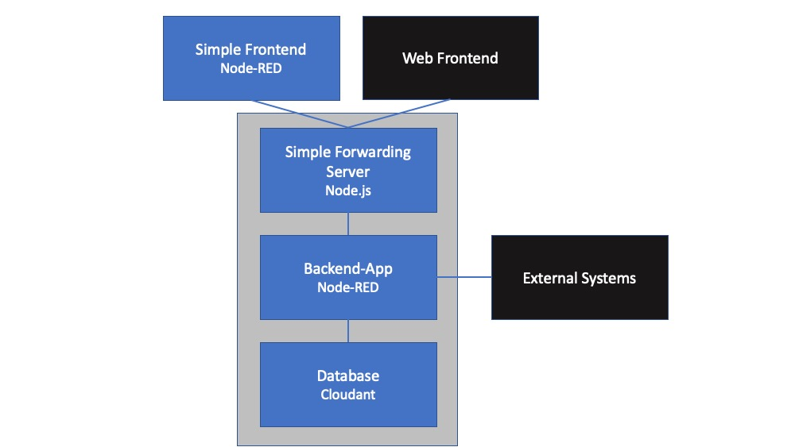
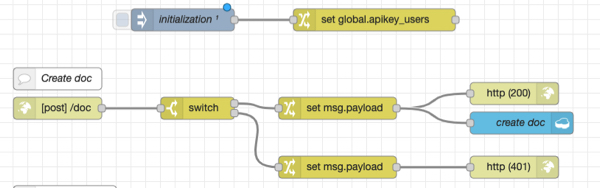

** UNDER CONSTRUCTION **

# Node-RED Backend

This solution consists of the following parts
- a Backend app (business logic, interfaces to external systems, CRUD requests to a Cloudant database),
- a simple forwarding server, needed to provide an interface to Web frontends, and 
- a simple Node-RED frontend to invoke the CRUD requests

It can be used for hackathons, prototypes and alike.

# Prequisites
- IBM Cloud account
- basic Node-RED & Docker knowledge

# Backend App
- install Node-RED, create a Cloudant service and bind the Cloudant service to the Node-RED app, see [A SHORT INTRODUCTION OF THE NODE-RED STARTER KIT ON IBM CLOUD FOR HACKATHONS](https://suedbroecker.net/2020/03/09/a-short-introduction-of-the-node-red-starter-kit-on-ibm-cloud-for-hackathons/)
- import the [Node-RED flow](https://github.com/gitjps/Node-RED-Cloudant-CRUD/blob/master/Node-RED.json) 
- deploy the flow

# Endpoints

## CRUD endpoints
- Create doc
- Get all docs
- Get doc
- Update doc
- Delete doc

## Other endpoints
not implemented yet

# How it works
The API key is set when the flow starts (initialization node).
When a request is received (e.g. *Create doc*), the header parameter *apikey*  is checked first. If it is not correct, a 401 error is thrown. Otherwise the requested actions is performed.

A REST calls in Node-RED flows cannot be invoked directly from a web application, a simple [forward server](/simple_forward_server) is needed.
Once it is implemented you can use the simple Node-RED or any other web frontend.
